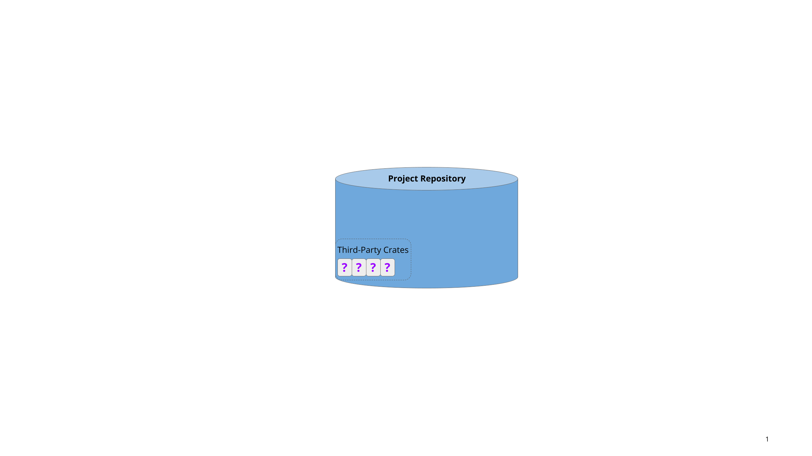
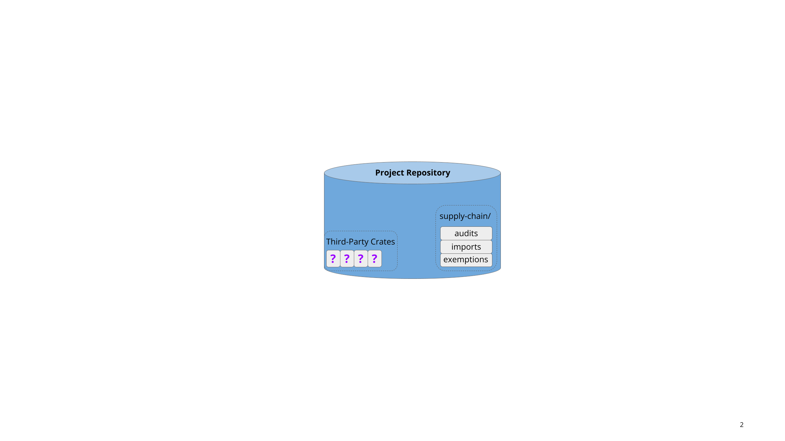
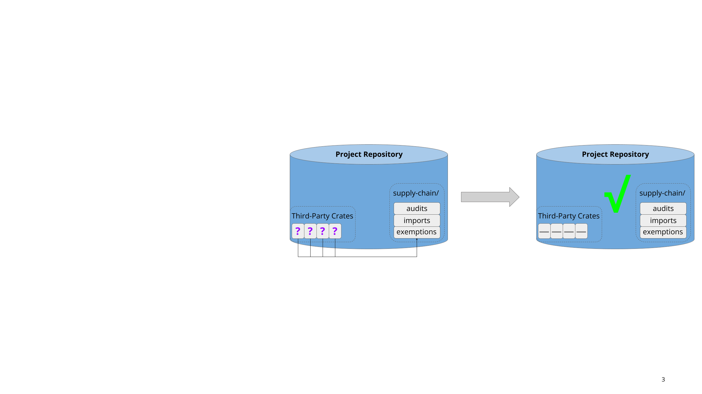
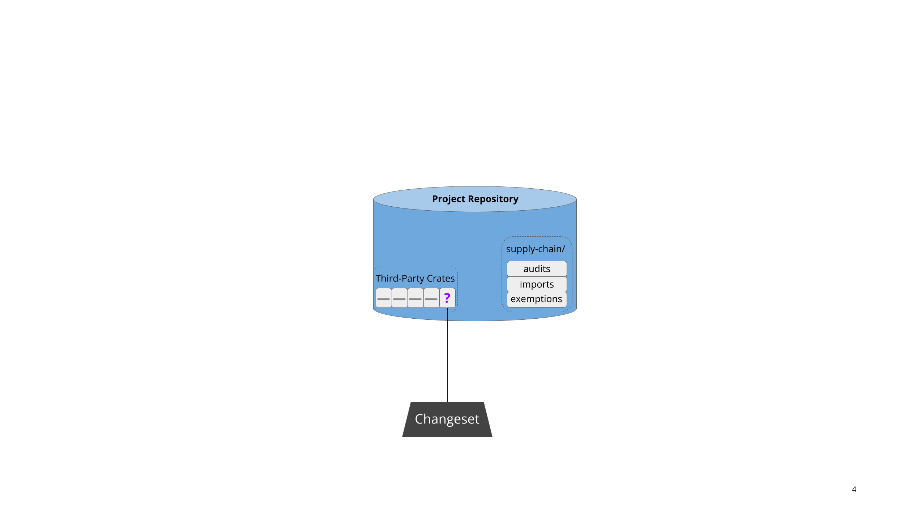
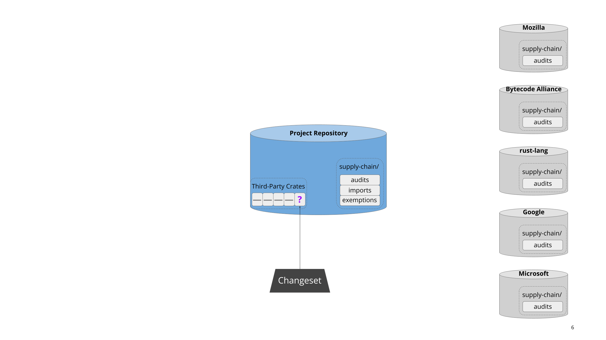
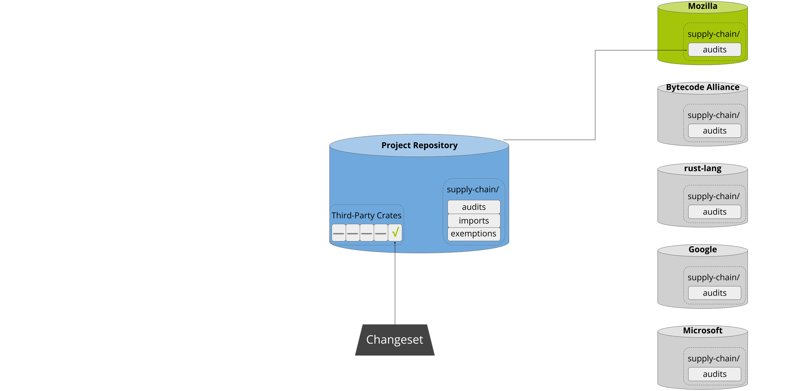
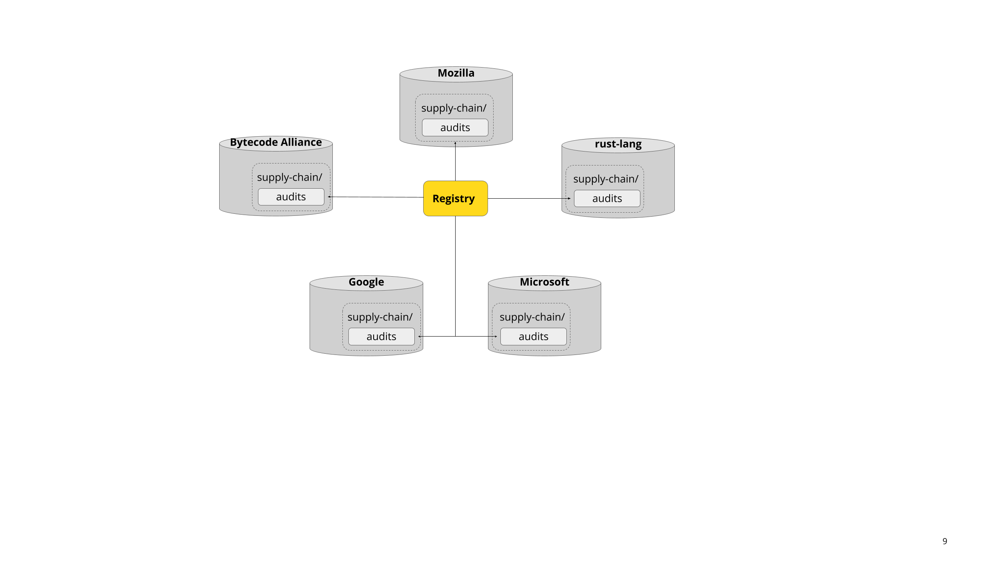

# How it Works

Most developers are busy people with limited energy to devote to supply-chain
integrity. Therefore, the driving principle behind cargo-vet is to minimize
friction and make it as easy as possible to do the right thing. It aims to be
trivial to set up, fit unobtrusively into existing workflows, guide people
through each step, and allow the entire ecosystem to share the work of auditing
widely-used packages.

This section provides a high-level overview of how the system operates to
achieve these goals.

## Setup

<!-- diagrams: https://docs.google.com/presentation/d/18svkEsm9K5gLQeJLfILGdMUTsujiDgzecrswcOAdceQ/edit -->

Cargo-vet is easy to set up. Most users will already have a repository with some
pre-existing third-party dependencies:

Cargo-vet can be enabled by adding the tool as a linter and running `cargo vet
init`, which creates some metadata in the repository:

This takes about five minutes, and crucially, does not require auditing the
existing dependencies. These are automatically added to the exemptions list:

This makes it low-effort to get started, and facilitates tackling the backlog
incrementally from an approved state.

## Adding New Third-Party Code

Sometime later, a developer attempts to pull new third-party code into the
project. This might be a new dependency, or an update to an existing one:

As part of continuous integration, cargo-vet analyzes the updated build graph to
verify that the new code has been audited by a trusted organization. If not, the
patch is refused:

Next, cargo-vet assists the developer in resolving the situation.  First, it
scans the registry to see if any well-known organizations have audited that
package before:

If there’s a match, cargo-vet informs the developer and offers the option to add
that organization to the project’s trusted imports:

This enables projects to lazily build up an increasingly wide set of approved
crates. Approval of both import and audit submissions automatically falls to the
code owners of the `supply-chain/` directory, which should consist of either
project leadership or a dedicated security team.

## Auditing Workflow

It may of course be the case that the developer needs to perform the audit
themselves, and cargo-vet streamlines this process. Often someone will have
already audited a different version of the same crate, in which case cargo-vet
computes the relevant diffs and identifies the smallest one[^1]. After walking
the developer through the process of determining what to audit, it then presents
the relevant artifacts for inspection, either locally, on
[Sourcegraph](https://sourcegraph.com), or on [diff.rs](https://diff.rs).

Cargo-vet minimizes developer friction by storing audits in-tree. This means
that developers don’t need to navigate or authenticate with an external system.
Interactions with cargo-vet are generally triggered when a developer creates a
changeset adding new third-party code, and this design allows them to simply
submit the relevant audits as part of that changeset:

## Sharing the Work

Cargo-vet’s mechanisms for sharing and discovery are built on top of this
decentralized storage. Imports are implemented by pointing directly to the
audit files in external repositories, and the registry is merely an index of
such files from well-known organizations:

This also means there’s no central infrastructure for an attacker to compromise.
Imports used to vet the dependency graph are always fetched directly from the
relevant organization, and only after explicitly adding that organization to the
trusted set.

Audit sharing is a key force-multiplier behind `cargo vet`, but it is not
essential. Projects can of course decline to add any imports and perform all
audits themselves.

## Additional Features

Cargo-vet has a number of advanced features under the hood — it supports custom
audit criteria, configurable policies for different subtrees in the build graph,
and filtering out platform-specific code. These features are all completely
optional, and the baseline experience is designed to be simple and require
minimal onboarding. You can learn more about them in the subsequent chapters of
this book.

## Footnotes

[^1]: Differential audits work even for crates in the exemptions list. While it
  might seem counter-intuitive to perform a relative security audit against an
  unknown base, doing so still provides meaningful protection against future
  supply-chain attacks.
